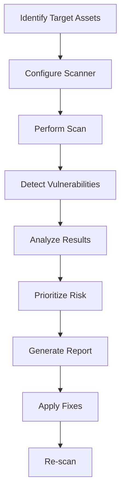
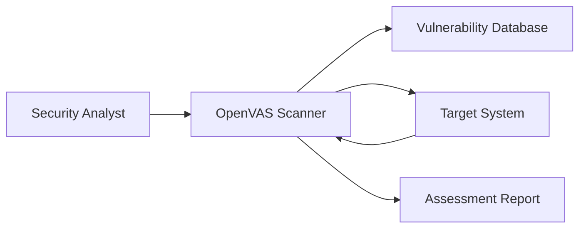
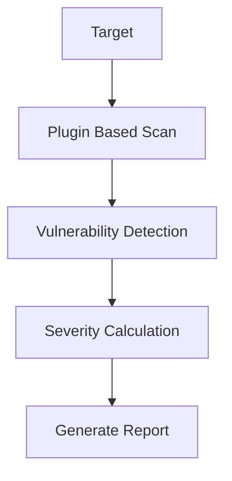
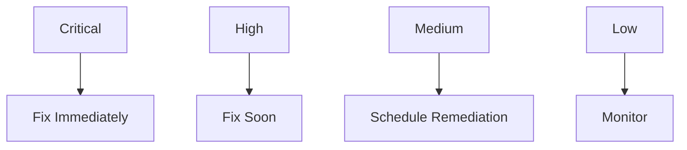

# Ethical Hacking (2413CYM5T1)

# Module 3
# Lecture 5
# Vulnerability Assessment Tools and Vulnerability Assessment Reports

**Duration:** 1 Hour

**Module:** 3

**CO Mapping:** CO3

---


# Recap

In the previous lecture, we studied:

- Vulnerability Assessment Concepts
- Vulnerability Lifecycle
- Types of Vulnerabilities
- CVE
- CWE
- CVSS
- NVD

Today's lecture focuses on **how these vulnerabilities are discovered in practice** using automated assessment tools.

---

# What is a Vulnerability Assessment Tool?

A Vulnerability Assessment Tool is a software application that scans computers, servers, applications, or networks to identify known security weaknesses.

These tools compare the target system against databases of known vulnerabilities and generate reports for security analysts.

---

# Vulnerability Assessment Workflow



---

# Popular Vulnerability Assessment Tools

| Tool | Purpose | Platform |
|------|---------|----------|
| OpenVAS (Greenbone) | Network Vulnerability Scanner | Linux |
| Nessus | Enterprise Vulnerability Scanner | Windows/Linux |
| Nikto | Web Server Scanner | Windows/Linux |
| Nmap NSE | Basic Vulnerability Detection | Windows/Linux |
| OWASP ZAP | Web Application Security Testing | Cross Platform |

---

# OpenVAS (Greenbone)

## What is OpenVAS?

OpenVAS (Open Vulnerability Assessment Scanner), now maintained as **Greenbone Community Edition**, is a free and open-source vulnerability scanner.

It can identify:

- Missing Security Updates
- Weak Configurations
- Open Ports
- Vulnerable Services
- Misconfigurations
- Known CVEs

---

## OpenVAS Architecture



---

# Basic OpenVAS Workflow

1. Create Target
2. Create Scan Task
3. Start Scan
4. Review Results
5. Export Report
6. Recommend Fixes

---

# Sample Scan Result

| Severity | Vulnerability |
|----------|---------------|
| Critical | Remote Code Execution |
| High | Outdated Apache Version |
| Medium | Weak TLS Configuration |
| Low | Information Disclosure |

---

# Nessus

## What is Nessus?

Nessus is one of the most widely used commercial vulnerability scanners developed by Tenable.

It supports:

- Network Assessment
- Compliance Auditing
- Configuration Review
- Patch Verification
- Malware Detection

---

# Nessus Scan Process



---

# Advantages of Nessus

- Easy to use
- Large vulnerability database
- Frequent updates
- Detailed reports
- Enterprise support

---

# Nikto

## What is Nikto?

Nikto is an open-source web server scanner.

It checks for:

- Dangerous Files
- Default Pages
- Outdated Server Versions
- Misconfigured Web Servers
- Insecure HTTP Methods

---

# Example Command

```bash
nikto -h http://example.com
```

> **Note:** Run vulnerability scans only against systems you own or have explicit authorization to test.

---

# Sample Nikto Output

```text
Target Host

example.com

Server

Apache/2.4.xx

Issues Found

Directory Listing Enabled

Missing Security Headers

Outdated Apache Version
```

---

# Nmap NSE Scripts

Nmap can perform limited vulnerability detection using the **Nmap Scripting Engine (NSE).**

Example

```bash
nmap --script vuln 192.168.1.10
```

Possible Checks

- SMB Vulnerabilities
- SSL Weaknesses
- FTP Anonymous Login
- HTTP Misconfiguration

---

# OWASP ZAP

OWASP ZAP (Zed Attack Proxy) is used to assess web application security.

Features include:

- Spidering
- Passive Scanning
- Active Scanning
- Fuzzing
- API Testing

Commonly used for:

- SQL Injection Detection
- Cross-Site Scripting (XSS)
- Security Header Analysis

---

# Comparison of Vulnerability Assessment Tools

| Tool | Best Used For | License |
|------|---------------|---------|
| OpenVAS | Network Vulnerability Assessment | Open Source |
| Nessus | Enterprise Vulnerability Assessment | Commercial |
| Nikto | Web Server Security Assessment | Open Source |
| Nmap NSE | Basic Vulnerability Detection | Open Source |
| OWASP ZAP | Web Application Security | Open Source |

---

# Understanding Vulnerability Assessment Reports

A vulnerability scanner generates a report after completing the scan.

A report typically contains:

- Target Details
- Scan Date
- Scanner Used
- Vulnerabilities Found
- CVE Numbers
- CVSS Scores
- Severity Levels
- Recommendations

---

# Sample Report Structure

```text
Target

192.168.1.20

↓

Scanner

OpenVAS

↓

Findings

12 Vulnerabilities

↓

Critical

2

↓

High

3

↓

Medium

4

↓

Low

3

↓

Recommendations
```

---

# Sample Vulnerability Report

| Severity | CVE | Description | Recommendation |
|----------|-----|-------------|----------------|
| Critical | CVE-2021-44228 | Log4Shell | Update Log4j |
| High | CVE-2024-6387 | OpenSSH Vulnerability | Upgrade OpenSSH |
| Medium | - | Weak Password Policy | Enforce Strong Passwords |
| Low | - | Missing HTTP Header | Configure Security Headers |

---

# How Security Analysts Prioritize Findings



---

# Best Practices

- Scan only authorized systems.
- Keep vulnerability databases updated.
- Verify critical findings before remediation.
- Re-scan after applying patches.
- Maintain scan reports for audits.
- Combine automated scans with manual verification.

---

# Think Like an Ethical Hacker

You scan a company's web server and obtain the following results:

| Severity | Issue |
|----------|------|
| Critical | Log4Shell |
| High | Outdated Apache |
| Medium | Weak Password Policy |
| Low | Missing HTTP Security Headers |

### Discussion

1. Which vulnerability should be fixed first?
2. Which issue presents the greatest business risk?
3. Which findings require immediate attention?

---

# Summary

In this lecture, we learned:

- Vulnerability Assessment Tools
- OpenVAS
- Nessus
- Nikto
- Nmap NSE
- OWASP ZAP
- Vulnerability Assessment Reports
- Risk Prioritization
- Best Practices

---

# Viva Questions

1. What is OpenVAS?
2. What is Nessus used for?
3. Differentiate OpenVAS and Nessus.
4. What is Nikto?
5. What is the Nmap Scripting Engine?
6. What is OWASP ZAP?
7. What information is included in a vulnerability assessment report?
8. Why is vulnerability prioritization important?
9. Why should systems be re-scanned after applying patches?
10. Why should vulnerability scans only be performed with authorization?

---

# University Examination Questions


1. Explain OpenVAS with its architecture and working.
2. Compare OpenVAS, Nessus, Nikto, and OWASP ZAP.
3. Explain the structure of a Vulnerability Assessment Report.
4. Describe the workflow of Vulnerability Assessment using suitable tools.
5. What is Nikto? Mention any two features.
6. State any four contents of a Vulnerability Assessment Report.
7. Differentiate OpenVAS and Nessus.

---

# Conclusion

Vulnerability Assessment tools automate the discovery of known security weaknesses and help organizations improve their security posture. However, the effectiveness of these tools depends on proper configuration, regular updates, accurate interpretation of results, and timely remediation. Automated scanning should always be complemented by manual verification and ethical testing practices.

---