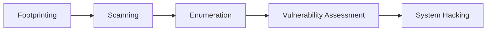
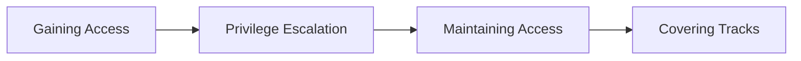
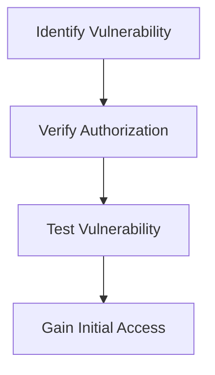
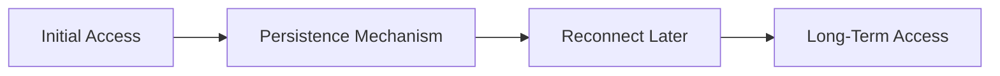
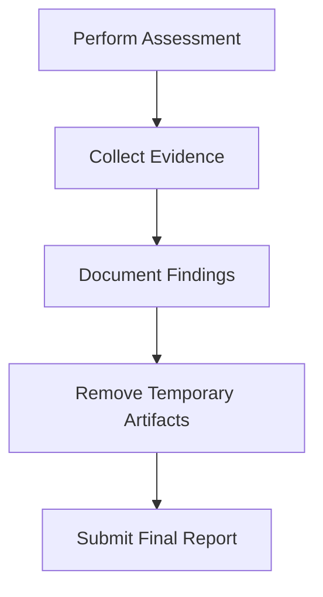
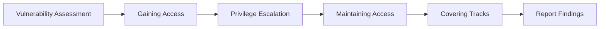

# Ethical Hacking (2413CYM5T1)

# Module 3
# Lecture 6
# System Hacking Concepts, Gaining Access, Privilege Escalation, Maintaining Access and Covering Tracks

**Duration:** 1 Hour

**Module:** 3

**CO Mapping:** CO3

---

# Recap

So far, we have studied:



After identifying vulnerabilities, an attacker may attempt to exploit them to gain unauthorized access.

Ethical hackers study these techniques to identify weaknesses and recommend appropriate security measures.

---

# What is System Hacking?

**System Hacking** is the process of identifying, exploiting, and demonstrating security weaknesses in a computer system during an authorized security assessment.

The primary objective is to evaluate the effectiveness of security controls and recommend improvements.

> **Important:** Ethical hackers perform these activities only with written authorization. The purpose is to improve security—not to damage systems or steal information.

---

# System Hacking Lifecycle



---

# Phase 1 – Gaining Access

The first objective is to obtain access to the target system.

Common reasons why attackers successfully gain access include:

- Weak Passwords
- Unpatched Software
- Misconfigured Services
- Default Credentials
- Vulnerable Applications

---

# Real-World Example

A company's web server is running an outdated version of Apache.

During an authorized penetration test, the security team identifies a known vulnerability with a published CVE. After obtaining approval, they verify whether the vulnerability can be exploited.

The successful verification confirms that the vulnerability must be patched immediately.

---

# Methods of Gaining Access

| Method | Example |
|----------|----------|
| Weak Passwords | Password Guessing |
| Software Vulnerabilities | Remote Code Execution |
| Misconfiguration | Default Credentials |
| Social Engineering | Phishing |
| Web Vulnerabilities | SQL Injection |

---

# Gaining Access Process



---

# Phase 2 – Privilege Escalation

After gaining initial access, the attacker may have only limited permissions.

The next objective is to obtain higher privileges.

Examples include:

- Standard User → Administrator
- Local Administrator → Domain Administrator
- Limited Shell → Root

---

# Types of Privilege Escalation

| Type | Description |
|------|-------------|
| Vertical Privilege Escalation | Obtaining higher permissions |
| Horizontal Privilege Escalation | Accessing another user's resources with the same privilege level |

---

# Privilege Escalation Example

```text
Guest User
      ↓
Standard User
      ↓
Administrator
      ↓
Root / Domain Administrator
```

---

# Common Causes of Privilege Escalation

- Weak File Permissions
- Unpatched Operating Systems
- Misconfigured Services
- Insecure Scheduled Tasks
- Weak Administrator Passwords

---

# Real-World Scenario

A user account has permission to execute administrative scripts without proper restrictions.

During an authorized assessment, the security team discovers that this configuration allows the user to obtain administrative privileges.

The issue is documented and corrected by modifying permissions.

---

# Phase 3 – Maintaining Access

Once access is obtained, an attacker may attempt to maintain persistent access.

Examples include:

- Creating Unauthorized User Accounts
- Installing Remote Administration Software
- Misusing Scheduled Tasks
- Leveraging Existing Remote Management Features

Ethical hackers verify whether such persistence is possible and recommend mitigations.

---

# Why is Maintaining Access Dangerous?

If persistence mechanisms remain undetected:

- Attackers may reconnect later.
- Sensitive information may continue to be exposed.
- Incident response becomes more difficult.

---

# Maintaining Access Workflow



---

# Phase 4 – Covering Tracks

After completing activities, an attacker may attempt to hide evidence of unauthorized actions.

Examples include:

- Deleting Temporary Files
- Removing Unauthorized Accounts
- Cleaning Up Test Artifacts
- Clearing Command History

> During ethical hacking engagements, all activities must be documented. Any temporary changes made during testing should be removed before the assessment is completed.

---

# Covering Tracks Workflow



---

# Complete System Hacking Workflow



---

# Countermeasures

Organizations should implement the following security controls:

- Apply Security Patches Promptly
- Enforce Strong Password Policies
- Enable Multi-Factor Authentication (MFA)
- Apply the Principle of Least Privilege
- Monitor Authentication Logs
- Conduct Regular Vulnerability Assessments
- Remove Unnecessary Accounts
- Review Administrator Privileges Periodically

---

# Best Practices for Ethical Hackers

- Obtain Written Authorization
- Define the Scope Clearly
- Avoid Disrupting Production Systems
- Document Every Activity
- Protect Collected Evidence
- Remove Temporary Testing Artifacts
- Submit a Detailed Security Report

---

# Think Like an Ethical Hacker

A security assessment identifies:

| Finding | Severity |
|----------|----------|
| Outdated Operating System | High |
| Weak Administrator Password | Critical |
| Unnecessary Administrator Account | High |
| Missing Security Updates | High |

### Discussion Questions

1. Which issue should be addressed first?
2. Which finding poses the greatest business risk?
3. What recommendations should be included in the final report?

---

# Summary

In this lecture, we learned:

- System Hacking Concepts
- Gaining Access
- Privilege Escalation
- Maintaining Access
- Covering Tracks
- Countermeasures
- Best Practices

---

# Quick Revision

```text
Identify Vulnerability
          ↓
Gain Access
          ↓
Privilege Escalation
          ↓
Maintain Access
          ↓
Cover Tracks
          ↓
Document Findings
```

---

# Viva Questions

1. What is System Hacking?
2. What are the phases of System Hacking?
3. What is Gaining Access?
4. Define Privilege Escalation.
5. Differentiate Vertical and Horizontal Privilege Escalation.
6. What is Maintaining Access?
7. Why is persistence dangerous?
8. What is meant by Covering Tracks?
9. State any four countermeasures against System Hacking.
10. Why should ethical hackers document every activity?

---

# University Examination Questions

1. Explain the phases of System Hacking with a neat diagram.
2. Explain Privilege Escalation and its types with suitable examples.
3. Describe methods used to maintain access and recommend suitable countermeasures.
4. Explain the concept of System Hacking and discuss defensive measures adopted by organizations.
5. Define Privilege Escalation.
6. Differentiate Vertical and Horizontal Privilege Escalation.
7. State any four countermeasures against System Hacking.

---

# Conclusion

System Hacking demonstrates how attackers may exploit identified vulnerabilities to obtain unauthorized access, increase privileges, and establish persistence within a target environment. Ethical hackers study these techniques to evaluate existing security controls, identify weaknesses, and recommend effective mitigation strategies. Every activity must be performed within an authorized scope, documented thoroughly, and aimed at strengthening the organization's overall security posture.