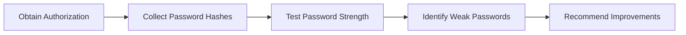
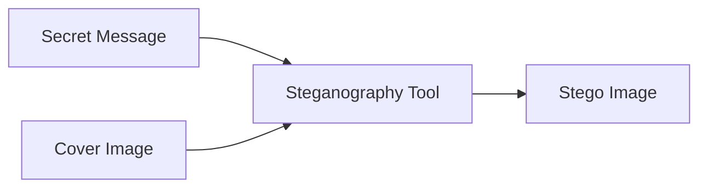
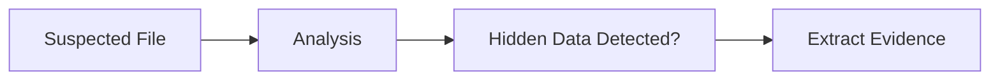
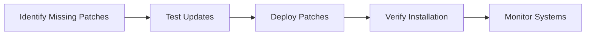
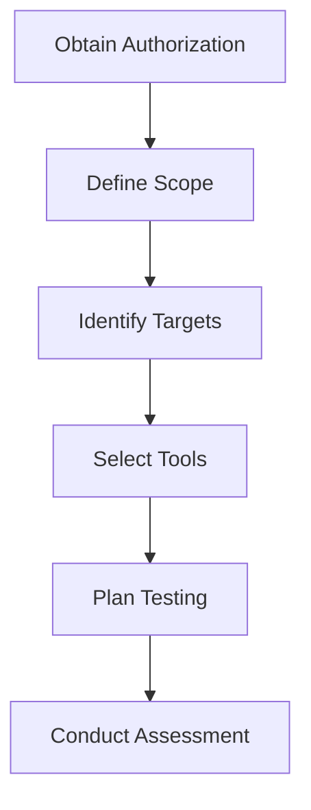
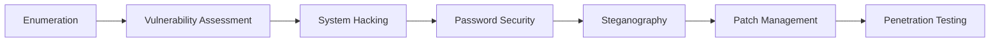

# Ethical Hacking (2413CYM5T1)

# Module 3
# Lecture 7
# Password Cracking, Password Attacks, Steganography, Steganalysis, Patch Management and Penetration Testing Preparation

**Duration:** 1 Hour

**Module:** 3

**CO Mapping:** CO3

---

# Recap

In the previous lecture, we studied:

- System Hacking
- Gaining Access
- Privilege Escalation
- Maintaining Access
- Covering Tracks

Today's lecture focuses on protecting systems by strengthening passwords, applying patches, and preparing for professional penetration testing.

---

# Password Security

Passwords are the first line of defense for most computer systems.

A strong password significantly reduces the chances of unauthorized access.

Characteristics of a strong password:

- Minimum 12–16 characters
- Combination of uppercase and lowercase letters
- Numbers
- Special characters
- No dictionary words
- Unique for every account

Example

```
Weak Password

password123

Strong Password

M@r2026!Secure#Lab
```

---

# Password Cracking

## What is Password Cracking?

Password Cracking is the process of recovering or testing passwords against stored password hashes or authentication systems during an **authorized security assessment**.

Ethical hackers perform password auditing only after obtaining permission from the system owner.

---

# Password Cracking Process



---

# Why Perform Password Audits?

Organizations perform password assessments to:

- Identify weak passwords
- Verify password policies
- Improve authentication security
- Reduce the risk of account compromise

---

# Common Password Attack Types

| Attack | Description |
|---------|-------------|
| Brute Force | Tries every possible password combination |
| Dictionary Attack | Uses a predefined word list |
| Hybrid Attack | Combines dictionary words with numbers and symbols |
| Password Spraying | Tests a common password across many accounts |
| Credential Stuffing | Uses credentials leaked from other services |

---

# Password Attack Comparison

| Attack | Speed | Success Depends On |
|---------|-------|-------------------|
| Brute Force | Slow | Password Length |
| Dictionary | Fast | Weak Password Choice |
| Hybrid | Medium | Predictable Modifications |
| Password Spraying | Fast | Weak Organizational Password Policy |
| Credential Stuffing | Very Fast | Reused Passwords |

---

# Password Protection Best Practices

- Use long passwords or passphrases.
- Enable Multi-Factor Authentication (MFA).
- Never reuse passwords.
- Change default passwords immediately.
- Use a password manager.
- Monitor failed login attempts.

---

# What is Steganography?

**Steganography** is the technique of hiding secret information inside another file so that the existence of the hidden information is concealed.

Unlike encryption, steganography hides the presence of the message itself.

---

# Real-World Example

A confidential message is hidden inside an image.

To a normal user, the image appears unchanged.

Only someone with the correct extraction method can recover the hidden message.

---

# Steganography Process



---

# Common Cover Files

Information can be hidden inside:

- Images
- Audio Files
- Video Files
- Text Documents
- PDF Files

---

# Steganography Tools

Common educational tools include:

| Tool | Purpose |
|------|---------|
| OpenStego | Hide data inside images |
| Steghide | Image and audio steganography |
| SilentEye | GUI-based steganography |
| OpenPuff | Multi-layer steganography |

---

# Applications of Steganography

Legitimate Uses

- Digital Watermarking
- Copyright Protection
- Secure Communication
- Research

Malicious Uses

- Malware Communication
- Data Exfiltration
- Concealing Sensitive Information

---

# What is Steganalysis?

Steganalysis is the process of detecting whether a file contains hidden information.

The goal is to determine:

- Whether hidden data exists.
- Which technique may have been used.
- Whether the hidden information can be extracted.

---

# Steganalysis Workflow



---

# Indicators of Hidden Data

Security analysts may observe:

- Unusual file size
- Metadata inconsistencies
- Unexpected image artifacts
- Statistical anomalies
- Modified file structures

---

# Patch Management

## What is Patch Management?

Patch Management is the process of identifying, testing, deploying, and verifying software updates to remove known vulnerabilities.

Regular patching is one of the most effective methods of preventing cyber attacks.

---

# Patch Management Lifecycle



---

# Benefits of Patch Management

- Removes known vulnerabilities
- Improves system stability
- Ensures regulatory compliance
- Reduces cyber risk
- Protects organizational assets

---

# Best Practices

- Maintain an inventory of assets.
- Apply critical patches immediately.
- Test patches before deployment.
- Maintain backups before updates.
- Verify successful installation.

---

# Penetration Testing Preparation

Before conducting a penetration test, proper planning is essential.

Preparation includes:

- Obtain Written Authorization
- Define Scope
- Identify Target Systems
- Select Testing Methodology
- Prepare Testing Tools
- Establish Communication Plan
- Define Reporting Requirements

---

# Penetration Testing Preparation Workflow



---

# Rules of Engagement

Every penetration test should clearly define:

- Scope of testing
- Allowed targets
- Testing schedule
- Authorized personnel
- Emergency contacts
- Reporting format

These rules protect both the organization and the testing team.

---

# Complete Module 3 Workflow



---

# Think Like an Ethical Hacker

During an authorized assessment, the following issues are identified:

| Finding | Severity |
|----------|----------|
| Weak Administrator Password | Critical |
| Missing Security Updates | High |
| Password Reuse | High |
| Outdated Operating System | High |
| No Multi-Factor Authentication | Medium |

### Discussion

1. Which issue should be addressed first?
2. How can password policies be improved?
3. Why is patch management important?
4. Why should penetration testing begin only after proper planning?

---

# Summary

In this lecture, we covered:

- Password Security
- Password Cracking
- Password Attacks
- Steganography
- Steganography Tools
- Steganalysis
- Patch Management
- Penetration Testing Preparation

---

# Quick Revision

```text
Strong Passwords
        ↓
Password Auditing
        ↓
Steganography
        ↓
Steganalysis
        ↓
Patch Management
        ↓
Penetration Testing
```

---

# Viva Questions

1. What is Password Cracking?
2. Differentiate Brute Force and Dictionary attacks.
3. What is Password Spraying?
4. What is Credential Stuffing?
5. Define Steganography.
6. Differentiate Encryption and Steganography.
7. What is Steganalysis?
8. Name any two Steganography tools.
9. What is Patch Management?
10. Why is Penetration Testing Preparation important?
11. What are Rules of Engagement?
12. State any four password security best practices.

---

# University Examination Questions

1. Explain different Password Attack techniques with suitable examples.
2. Explain Steganography, its applications, tools, and Steganalysis.
3. Explain the Patch Management lifecycle with a neat diagram.
4. Describe the preparation phase of Penetration Testing and explain the Rules of Engagement.
5. Define Password Cracking.
6. What is Steganography? Give any two applications.
7. State any four best practices for Patch Management.

---

# Conclusion

Password security, steganography, and patch management are essential components of modern cybersecurity. Strong authentication practices reduce unauthorized access, steganography demonstrates how information can be concealed within digital media, and patch management eliminates known vulnerabilities before they can be exploited. Proper planning and clearly defined Rules of Engagement ensure that penetration testing is conducted safely, legally, and effectively. These concepts complete Module 3 and prepare students for the next module on Malware, Sniffing, and Social Engineering.
